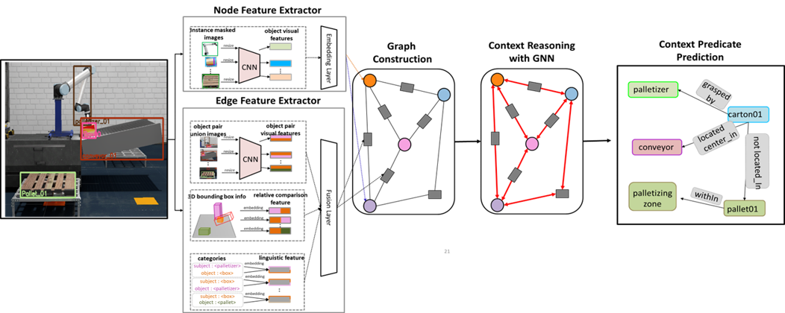

# Graph Context Manager(GCM)
제조/물류 환경에서 다중 로봇 작업을 위한 시-공간 작업 맥락 그래프의 생성과 맥락 추론기 개발



## Description
협업 상대 로봇의 행동 맥락(Action Context) 정보를 추론하는 그래프 신경망 기반 맥락 추론 모델입니다.


## Features
- **데이터 수집 및 처리**: Isaac 시뮬레이터에서 직접 수집한 데이터셋 이용
- **모델 구현**: GCN, TripletGCN 그래프 신경망 모델 이용
- **결과 시각화**: Graphviz API 활용하여 학습된 모델의 추론 결과를 시각화 및 저장 

---

## 📂 Directory Structure

    ├── datasets/                        # 데이터 로더
    │   ├── GCMDataLoader.py             
    │   ├── raw/                         # 원본 데이터
    │   │   ├── Isaac/                   # Isaac 데이터셋
    │   │   └── MOS/                     # MOS 데이터셋
    ├── models/                          # 네트워크 모델 정의
    │   ├── CloudGCM_Network.py          
    │   ├── network_RelNet.py            
    │   ├── TripleNetGCN.py              # TripleNet GCN 모델
    │   ├── TT_GCN.py                    
    │   └── utils/                       
    │       ├── Graph_Vis.py             # 그래프 시각화 코드
    │       ├── visualization.py         # 시각화 유틸리티
    │       └── op_utils.py              
    ├── rule_based_contextManager/       # 규칙 기반 맥락 추론 모듈
    │   └── RuleContextManager.py        
    ├── data_collecter/                  # 데이터 수집 모듈
    │   └── DataCollecter.py             
    ├── GCM_main.py                      # 메인 실행 스크립트

---

## 🛠️ Dependencies
    
    ```bash
    conda create -n gcmAgent python=3.8
    conda activate gcmAgent
    pip install -r requirements.txt
    pip install torch==1.12.1+cu113 torchvision==0.13.1+cu113 torchaudio==0.12.1 --extra-index-url https://download.pytorch.org/whl/cu113
    pip install torch-scatter -f https://pytorch-geometric.com/whl/torch-1.12.1+cu113.html
    pip install torch-sparse -f https://pytorch-geometric.com/whl/torch-1.12.1+cu113.html
    pip install torch-spline-conv -f https://pytorch-geometric.com/whl/torch-1.12.1+cu113.html
    pip install torch-geometric
    '''
    
## Run Code
    
 1. Train

    ```bash
    python GCM_main.py --mode train --lr 0.001 --epochs 300 --batch_size 16 --gcn_layers 4
    ```
2. Test
    ```bash
    python GCM_main.py --mode test --pretrained save_models/gcn_model99.pt
    ```

3. Visualization
    ```bash
    cd utils
    python visualization.py
    ```

---

## 신경망 학습 기반 맥락 추론기 데모

[](https://www.youtube.com/watch?v=MRAI9zBHEMg)

